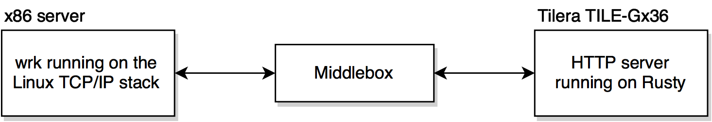
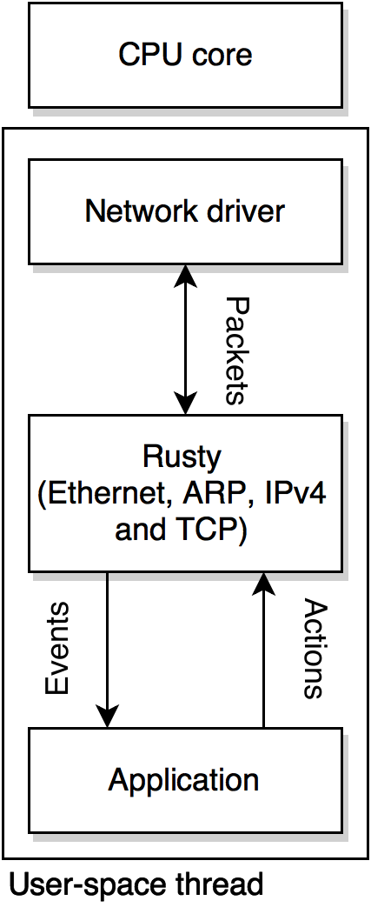

# Introduction

This document summarizes the software I developed as my final year project.

I was asked to design a very fast *HTTP* traffic generator. The purpose of
this traffic generator was to simulate a very large amount of *HTTP* sessions
to qualify layer-4 middleboxes for deployment on production networks. The goal
was not to detect any error caused by the middlebox, but only to generate a 
sufficient *HTTP* traffic in order to check the ability of the middlebox to
endure a such throughput.

Desire was expressed that *HTTP* traffic could be generated at a rate of up to
40 Gbps, using four 10 Gbps *Ethernet* links.

It was required that the software should run on a *Tilera TILE-Gx36* device,
an extension card orchestrated by a proprietary *TILE-Gx* 36-core
low-consumption microprocessor. The device is designed to run high performance
network applications and has four 10 Gbps network interfaces. It is a computer 
on its own and it runs the *Linux* operating system.

The project resulted in the design and development of *Rusty*, a light-weight,
event-driven and highly-scalable *TCP/IP* network stack.

Although network applications powered by *Rusty* are not able reach the 40 Gbps
goal, they benefit from an huge increase in performances when compared to the
*Linux* network stack running on the same hardware.

The high-performance web-server developed to generate *HTTP* traffic gets a
2.6× improvement in throughput when running on *Rusty* instead of the new
high-performance reusable *TCP* sockets introduced in *Linux 3.9*.

The web-server was able to deliver static *HTML* pages at a rate of 12 Gbps
*TCP* on the *Tilera TILE-Gx36* device. This number could be significantly
improved by carrying out some optimizations that have not been implemented,
because of a lack of time.

The network stack directly calls the proprietary *Tilera*'s network driver,
by-passing the operating system. It has been designed to be easily adapted to
other user-space network drivers, available with some professional NICs. As
performances are currently bounded by the relatively low processing power of the
*TILE-Gx* microprocessor, an huge increase in performances could also be
expected by porting *Rusty* to a faster CPU architecture.

Source code of the new *TCP/IP* stack and of the web-server is available at
[github.com/RaphaelJ/rusty/](https://github.com/RaphaelJ/rusty/).

## A very fast *HTTP* traffic generator

The goal of this final year project was to develop a test-bed to evaluate the
capacity of network middleboxes currently developed at the *University of
Liège* to sustain high loads of *HTTP* traffic.

The middleboxes are to be located between one (or several) *HTTP* request
generator(s) and one (or several) *HTTP* server(s). *HTTP* request gerator(s)
and *HTTP* server(s) should generate as much *HTTP* sessions as possible, and 
should be able to tell at which rate traffic was delivered.

The ultimate goal of the project was to make up to 40 Gbps of *HTTP* traffic
going through the middlebox.

Middleboxes are expected to have four 10 Gbps *Ethernet* links. To benefit from
the full-duplex capacity of the links, it was strongly suggested that *HTTP*
requests and responses should transit in both directions of a single link.
Suppose that you have two full-duplex links between the middlebox and a single 
testing device (as in the following diagram), the request generator running on 
the first link could send requests to the web-server running on the second link, 
and vice-versa. This doubles the traffic passing through the middlebox per link.

The university network laboratory has a *Tilera TILE-Gx36* device with four
10 Gbps *Ethernet* links. It was requested that the entire test-bed should run
on this device. The device use a proprietary 36-core CPU, runs the *Linux* 
operating system, and has network co-processors for packet classification.

It appeared at a very early stage in the project that the *Linux* network
stack will never be able to sustain the requested amount of traffic on requested
device. To address this issue, a new high-performance *TCP/IP* stack was
developed from scratch. This new stack, named *Rusty*, significantly improved
the performances, but I was not able to reach the targeted 40 Gbps throughput.

*Rusty* is not yet able to initiate connections, because of an
unresolved issue with the *Tilera*'s driver when using multiple cores. The
issue is described in the *Implementation details* chapter. Because of that, 
the *HTTP* request generator is running on another device, an high-end *x86* 
server with several 10 Gbps *Ethernet* NICs. This server is fast enough to 
sufficiently load the web-server running on the *TILE-Gx36*.

The web-server running on the *TILE-Gx36* has been written specifically
for this project. The request generator running on the *x86* is *wrk*,
a scriptable *HTTP* benchmarking tool [Gloz15].

## Rusty

*Rusty* is the name of the *TCP/IP* stack that was developed to increase the
throughput of the traffic simulator. The software is written using the *C++* 
programming language.

It follows the original TCP specification [RFC793] with the congestion
control algorithms described in \[RFC5681\] (slow start, fast retransmit and
and fast recovery).

It has a architecture designed for efficiency and high-scalability:

* It is an **user-space** network stack. Apart from its initialization and some
  memory allocations, it does not rely on the operating system. It uses the
  network driver while in user-space and does not produce any system call
  (except for  some rare cases such as page fault handling). Once initialized,
  it binds itself to some CPU cores and disables preemptive multi-tasking for
  these cores (so  the operating system do not issue context-switches). This is
  detailed in the *Implementation details* chapter.
* It is an **highly-parallelizable** network stack. It spawns as much instances
  of itself as the number of CPU cores it can use. Each instance handles only a
  subset of the TCP connections — a given connection is always handled by the
  same core —, and does not share anything with other stacks.
  There is no mutual exclusion mechanism and the software scales almost linearly
  with respect to the number of processing cores (*Rusty* is 31 times faster on
  35 cores than on a single core !). The architecture is presented in the
  *Implementation details* chapter while the observed scalability is discussed
  in *Performance analysis*.
* It is an **event-driven** network stack. The application layer responds to
  events, such as a new connection, a new arrival of data, or a notification
  that the remote user closed the connection. The application layer does this
  by providing function pointers that handle these events. As the *Rusty*
  instance that handle the connection and the application both run on the same
  core and thread, in user-space, the overhead of passing data from the network
  stack to the application layer is only that of a function pointer call.
  It is radically different from traditional stacks where blocking calls such as
  `recv()` or `accept()` produce system calls, and often context-switches.
* It has a **zero-copy** interface. The application layer directly accesses the
  memory buffers used by the network interface. `send()` and `recv()` calls, as
  implemented in most network stacks, require the data to be copied from and t
  application buffers. The machinery behind this zero-copy interface is detailed
  in the *Implementation details* chapter.

The next chapter gives an example of an event-driven network application
written with *Rusty*.

There are other user-space and highly-parallelizable network stacks, of which
two are briefly introduced in the *Similar network stacks* chapter.

> **Note** *Rusty* also distances itself from the original TCP specification
> by ignoring *Urgent* and *Push* flags. They do not make much sense in an
> event-driven *TCP/IP* stack, as segment payloads are always delivered to the
> application layer at the instant they are received.

To improve performances, *Rusty* also provides a way to **pre-compute *Internet*
checksums** of transmitted data. This gives a noticeable speedup for
applications, such as the web-server, where the data that can be transmitted is
determined in advance. Pre-computing checksums is not as easy as it may look,
because you do not know in advance how the data will be chunked in *TCP*
segments. The technique used is described in the *Implementation details* 
chapter.

## Performance overview

This section only summarizes the performances and the scalability of
*Rusty*. A detailed analysis and the methodology applied are available in the
*Performance analysis* chapter.

*Rusty* shows an exceptional ability to scale up with additional processing
cores. This exhibits the efficiency of the multi-threading model that has been
put in place.

The following graph compares the maximum throughput of the same *HTTP* server
on the *Tilera TILE-Gx36* for a given number of CPU cores, when using *Rusty*
and when using the *Linux* stack. The *Linux* version uses *epoll* with reusable
sockets, which is the advised method to write efficient network applications
by the *Linux* kernel developers [Kerr13].

With all the 36 cores are enabled, the *Rusty* implementation puts 12 Gbps on
the wire (about 11,000 *HTTP* requests second). This is a 2.6× improvement
against the *Linux* version which is only able to deliver 4.6 Gbps (about 4,000
*HTTP* requests second).

While these performances are engaging, the *TCP/IP* stack has not been
seriously optimised yet (because of a shortage of time). Dynamic memory
allocations (currently required to handle timers, transmission queues and
functionnal closures) consume a large fraction of the CPU cycles required to
handle a segment, and could be widely reduced.

Performances are also relatively low because of the relative ineficiency
of the *TILE-Gx36* processor. Performances are mostly bounded by the computing
power of the CPU, and this chip is about several times slower than a modern
high-end *x86* microprocessor.
