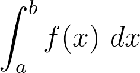
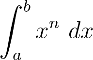

# Event-driven network applications

*Rusty* interacts with the application layer through an event-driven interface.
Basically, the application layer provides functions to handle events such as a
new incoming connection (on a listening *TCP* port), a new arrival of data on
an established connection, or the closing of a connection. It then reacts to
these events, by doing actions such as requesting to send data or to close a
connection.

In this chapter, you will be presented how to write a simple multi-threaded
echo server. The application accepts new connections on a listening socket and
echoes back data received on established connections.

## Closures

In this chapter, we will use a new *C++* feature introduced in the 2011 revision
of the language: *closures*. Closures are functions that can be defined inside
another function (as an expression) and that can *capture* the environment of
the parent function (i.e. variables' values). Closures are also known as *lambda
expressions*, and exist in almost any modern language (well, actually, they
somehow existed before programming languages).

As an example, suppose that you have a function that numericaly computes the
integral of another function `f`, between `a` and `b`:



This integration function has been written so it can be used with any `f`
function. In other words, the function accepts a function as argument, and its
signature is:

```C++
double integral(double a, double b, function<double(double)> f);
```

The `function<double(double)>` type of the third argument tells us that `f` is
a function that accepts a `double` and returns a `double`. If we wish to
compute the integral of `sqrt(x)` between *0* and *10*, all we would have to do 
is doing this call:

```C++
integral(0, 10, sqrt);
```

But now suppose that we want to write a function that compute this integral for
any value of `a`, `b` and `n`:



We would not be able to do that is a simple function pointer as with `sqrt`,
as we would need to transmit the value of the `n` parameter. Closures enable us
to "create" a function which will capture this `n` parameter:

```C++
double integral_pow(double a, double b, double n)
{
    function<double(double)> f =
        [n](double x)
        {
            return pow(x, n);
        };

    return integral(0, 10, f);
}
```

We created a function called `f` which captured the `n` parameter (`[n]` tells
the compiler that `n` has been captured), then we used it in the call
`integral()`.

Closures can be used to write event handlers for *Rusty*.

## Initializing the network stack

The first step is to initialize the network stack. This is done by initializing
the lower layer of the network stack, namely the abstraction layer over the
network driver.

Three parameters must be supplied:

* The interface and its associated *IPv4* address on which the stack will run.
  In this example, we use the `xgbe1` 10 Gbps Ethernet interface. The *ARP*
  layer  will announce the address, and outgoing *IPv4* datagrams will be
  delivered  from this address.
* The number of cores that *Rusty* will use to run this network stack. Here we
  chose to use 35 cores of the *TILE-Gx36* device. We can not use more than 35
  cores on this 36-core device, as *Rusty* takes total execution control of
  these cores, and as at least one core must be left free for the operating
  system to run.

This following call constructs a `stack` object using the `mpipe_t` network
driver (*mPIPE* is the name of the driver provided by *Tilera* for its NICs).
The call only allocates resources and initializes the network driver. It does 
not actually start the network stack.

```C++
rusty::driver::mpipe_t stack("xgbe1", "10.0.2.1", 35);
```

> **Note**
> If we wished to use several network interfaces, we would have created several 
> `stack` objects, one per interface.

## Adds a listening port

We would like to echo data coming on incoming connections on port 22.

First, we need to open the port for new connections. To do that, we call the
`tcp_listen()` method on the previously initialized `stack` object. In addition
to the port on which the stack must listen, the method accepts a function that
will be called each time an new connection is established. Let's call
`tcp_listen()` to listen on port 22 with a function that we will define later:

```C++
stack.tcp_listen(22, new_connection_handler);
```

## Handle connection events

It is time to define the `new_connection_handler` function we used in the
`tcp_listen()` call. The function must accept a connection as argument (as a
`cont_t` value) and must return a new `conn_handlers_t` value containing a set
of handlers for this connection. Its type signature must be:

```C++
conn_handlers_t new_connection_handler(conn_t conn);
```

The `conn_handlers_t` data-type contains four functions, each one handling one
type of event that can happen on an established connection:

```C++
struct conn_handlers_t {
    // Called when the connection receives new data.
    function<void(cursor_t)>                new_data;

    // Called when the remote asked to close the connection.
    function<void()>                        remote_close;

    // Called when both ends closed the connection. Resources allocated for
    // the connection should be released.
    function<void()>                        close;

    // The connection has been unexpectedly closed (connection reset).
    // Resources allocated for the connection should be released.
    function<void()>                        reset;
};
```

The `new_data` handler is given a `cursor_t` value. Cursors are an abstraction
over network buffers that enable zero-copy reading and writing. As of now, just
assume they are similar to *Streams* in *Java* or *C++*. Cursors are detailed
in the `Implementation details` chapter to follow.

So, now, we can write the `new_connection_handler` function. The function 
receives the identifier of the new connection and return a new `conn_handlers_t`
value.

```C++
conn_handlers_t new_connection_handler(conn_t conn)
{
    conn_handlers_t handlers;

    handlers.new_data =
        [conn](cursor_t in) mutable // 'mutable' tells the compiler that the
                                    // closure change the state of the 'conn'
                                    // variable.
        {
            // Sends the received data back to the remote device.

            size_t size = in.size();

            // The 'send' method receives three values:
            // * The size of the data to send.
            // * A function to execute to write the data in the network buffer.
            //   These 'writers' are required as the network buffer may not be
            //   allocated immediately. Writers are detailed in the 
            //   'Implementation details' chapter.
            // * A function to execute when the data has been acknowledged.
            conn.send(
                size,
                [in](size_t offset, cursor_t out)
                {
                    out.write(in.drop(offset).take(out.size()));
                },
                do_nothing // Does nothing when data is acknowledged.
            );
        };


    handlers.remote_close =
        [conn]() mutable
        {
            // Closes the connection when the remote half-closed the connection.
            conn.close();
        };

    handlers.close = do_nothing;
    handlers.reset = do_nothing;

    return handlers;
}
```

`do_nothing` is a function that, well, does nothing. It is used as an handler 
that does nothing when the event occurs.

*Rusty* carries out an optimization permitted by the *TCP* protocol when one
sends data while in the `new_data` handler, like we did. It will combine our
response with the acknowledgement segment of the received data, saving one
segment. That is because the network stack has not acknowledged the received
data yet. Similarly, the `FIN` segment the stack sends when we call
`conn.close()` will be combined with the acknowledgement of the received `FIN`
segment that triggered the `remote_close` event (if the transmission queue is
empty).

> **Note**
> Handlers should not execute for too long, as they take the execution control
> from the network stack. If an handler takes too much time to execute, this 
> could delay the processing of incoming packets, and causes a retransmission of
> data from the remote *TCP*. Some user-space stacks provide a kind of
> multi-threading to address this issue.
> A a similar problem arises in event-driven GUIs when a time consuming event
handler can freeze the whole graphical interface.

## Start the network stack

Now that we have initatialized *Rusty* with our application layer, we can start
the stack on the worker threads by calling the `run()` method. As the `run()`
method returns immediately after the threads have been launched, we also need 
to call the `join()` method that wait for the termination of these threads
(which will never happen as the application layer never asks the stack to
stop processing packets by calling the `stop()` method):

```C++
stack.run();
stack.join();
```

The complete echo application is available in the `app/` directory of the
source code repository of *Rusty*
([github.com/RaphaelJ/rusty/](https://github.com/RaphaelJ/rusty/)).