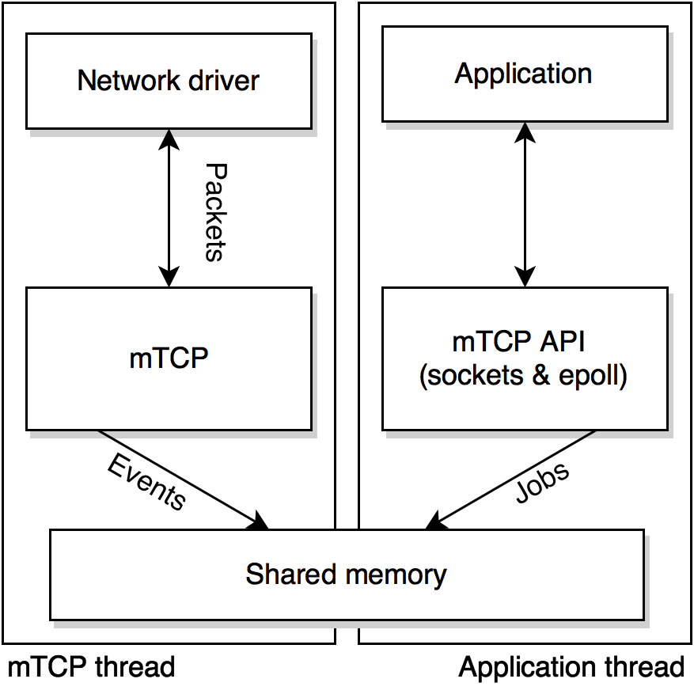
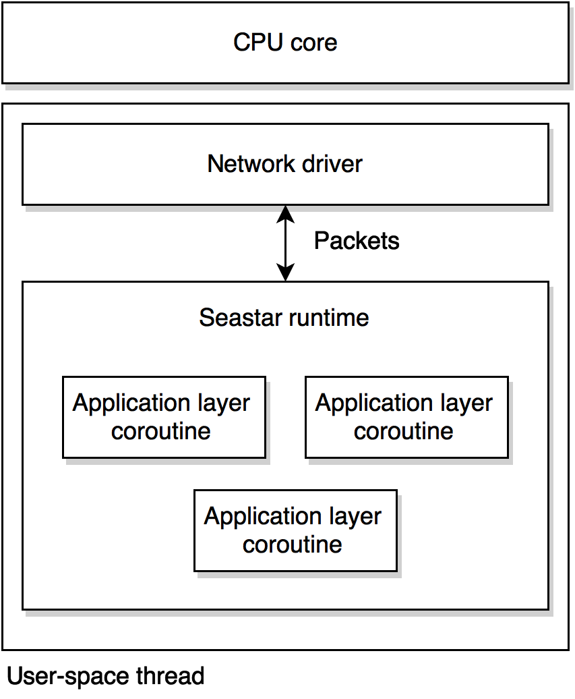

# Similar network stacks

*Rusty* is not the first user-space *TCP/IP* stack designed for high
performances.

I mostly looked at two existing stacks before and while developing *Rusty*:
*mTCP* [JWJ⁺14] and *Seastar* [Clou15]. Both use an user-space driver for some
*Intel* 10 Gbps *Ethernet* NICs. *Seastar* has a similar architecture to
*Rusty* while the architecture og *mTCP* is quite different.

## mTCP

*mTCP* provides an implementation of *epoll* and *BSD* sockets that runs
in user-space (and is thus almost backward compatible with simple
applications running on these).

Unlike *Rusty* (and *Seastar*), the network stack does not run on the same
threads as the application layer. Each application layer thread is coupled with
an *mTCP* thread (that runs the network stack and the network driver in
user-space). Both are affinitized to the same CPU core. They share a event
queue and a job queue. Events (such as the reception of new data) are produced
by the *mTCP* thread and consumed by the application layer thread, while the
jobs (such as new data to transmit) are produced by the application thread and
executed by the *mTCP* thread.

Connections are local to a single *mTCP* thread (they are not shared). Because
of that, they achieve a better scalability than the *Linux* *TCP/IP* stack.
They chose to run the application layer on a separate thread so it does not
affect the behaviour of *TCP* (a long computation in the application layer on
*Rusty* can produce retransmissions from the remote as the processing of 
incoming packets would be delayed). The drawback is that they must carry the
overhead of the operating system scheduler, and that they can not provide a
zero-copy interface as *Rusty* does.

On a 8-core (16 hardware threads) *Intel Xeon*, they achieve a 2.2× improvement
in performances compared to the *Linux* stack with reusable sockets on small
(64 B) messages. They also point out that the *Linux* stack is not able to
scale correctly over more than 4 cores on this hardware.

In the first days of my Master's thesis, I was suggested to modify this stack so
it can be used on the *TILE-Gx36*. But, after going through the source code,
I thought that it would be way more painful to modify this poorly documented
software than creating a new *TCP/IP* stack myself. Also, the software
is strongly coupled to the network driver it uses, making the porting work even 
harder. *mTCP* was developed more as a proof-of-concept than as a reusable 
system.

## Seastar

*Seastar* is an open-source framework developed by *Cloudius Systems*.
It was released to the public for the first time during the second half of
February 2015, and I became aware of it by the end of April (at a time when
*Rusty* was already seriously being developed). The project is still actively
developed, with 10 different contributors during the month of July 2015,
according to the the public code repository.

The framework is slightly more advanced than *Rusty* or *mTCP*. Like *Rusty*,
it runs a single thread per core. However, it allows the application layer
to run multiple cooperative tasks, or coroutines: in addition to its *TCP/IP*
stack, the *Seastar* runtime provides a cooperative multitasking system.
The application layer executes itself in these coroutines, and must give
execution control back to the runtime voluntarily, or by making call to 
`send()`, `recv()` or other function calls that would be blocking in traditional
network stacks. Unlike operating system threads, coroutines are never preempted.

This cooperative model has a small overhead, as coroutines have their own
call stacks. Context-switches are however significantly faster than those of an
operating system (such as in *mTCP*), as it is only about substituting CPU
registers. The scheduling algorithm is also simpler, and mostly relies on events
from the network.

Unlike *mTCP*, *Seastar* is not backward compatible with software written using
*BSD* sockets. Applications must be written with the cooperative multitasking
model in mind.

> **Note**
> A such cooperative multitasking system could be implemented on top of *Rusty*.
> The event-driven model is a kind of lower level interface with the network
> stack.

The *Seastar* framework could have been modified to run on the *Tilera*'s
network driver, as the network stack is reasonably disassociated from the
network driver. It would still be an huge amount of work (network buffers work
very differently in the driver they use (*DPDK*), and the framework has become
quite huge), but it would be definitively doable within the context of this
Master's thesis. I did not do that because I was already too advanced in my own
*TCP/IP* stack at the time I became aware of the *Seastar* project.
