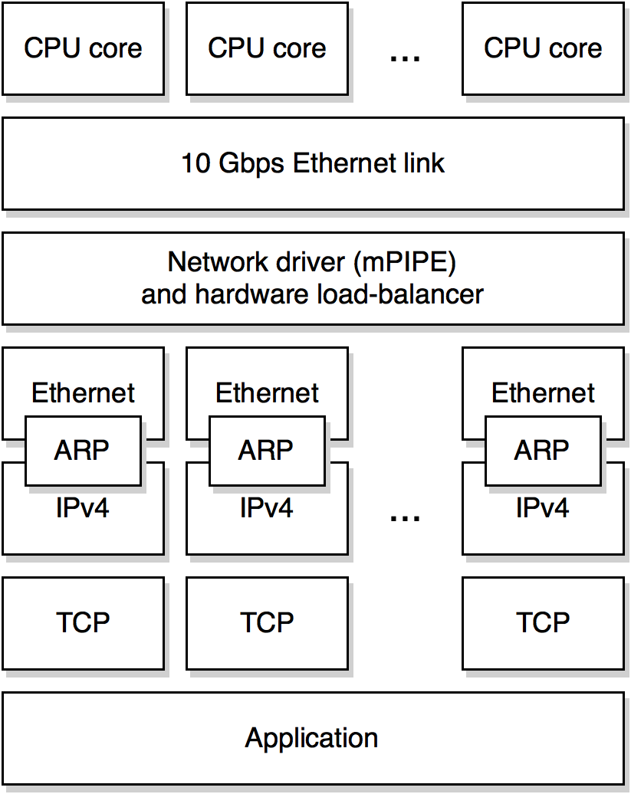
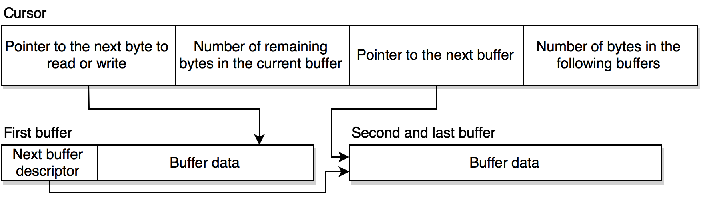

# Implementation details

The first section summarizes the specifics of the used 36-cores *TILE-Gx*
architecture.

These second section 

## Development environment summary

The framework have been developed for the ***TILE-Gx36* processor**.

The *TILE-Gx* processor family has been developed by *Tilera*, until the company
was acquired by *EzChip* during the summer 2014.

The family has been declined in 9, 16, 36 and 72-cores models. These use a
proprietary 64-bits RISC instruction set and run at a **1.2 Ghz frequency**.

*TILE-Gx* processors have two *DDR3* memory controllers, and a theoretical
**maximal memory bandwidth of 25.6 Gbps**.

These CPUs are designed to run network related software. As a result, they
also have:

* *Co-prosessors* for packet analysis, network flow load-balancing, compression
  and encryption.
* *Integrated 10 Gbps Ethernet controllers* to maximise network throughput,
  especially on small packets.

The device used to implement this project is engineered around a 36-core
*TILE-Gx* chip, in the form of a *PCI-Express* extension card. It is a computer
on its own, having its dedicated *DDR3* memory and **four 10 Gbps *Ethernet*
links**. It runs the *Linux 3.10* operating system.

## Parallelisation and scalability



**The framework has been designed to be highly parallelizable**, benefiting from
the *hardware network load-balancer* included in the *TILE-Gx36* processor.

**The hardware load-balancer has the ability to distribute incoming network
packets around multiple software queues**. Queue selection is based on a
combined hash function of the *IPv4* addresses and *TCP* ports of the incoming
packet.
Namely, packets belonging to a same *TCP* flow (source address, source port,
destination address and destination port) are always delivered to the same
software queue.

When the framework runs on several CPU cores, as much *TCP/IP* stacks and
ingress queues are instancied. **Each network stack instance is continuously
polling its queue for a new incomming packet to process. A core is entirely 
dedicated to the execution of its associated network stack** (the operating
system can not initiate a context-switch as preemptive multi-tasking is disabled
for these cores). The main loop executed by each core looks like this one:

```C
while (app_is_running) {
    execute_expired_timers();

    if (incomming_queue.is_empty())
        continue;

    packet_t packet = incomming_queue.pop();
    network_stack.receive_packet(packet);
}
```

> **Note**
> One can notice that the timers set is continuously checked for expired timers.
> Timers are detailed later in this document.

The network driver, provided by the *Tilera development framework*, runs in
user space and does not require any system call when transmitting or
receiving packets.

> **Note**
> Processes can still enter kernel space, because of a system call, some
> interruption, or a page fault.

Each running core will be in charge of dealing with its own subset of *TCP*
connections (as determined by the load-balancer), and will not share any
connection with another core. **Cores do not share any mutable state**, no
mutual exclusion mechanism is required.

> **Note**
> One could argue that the *ARP* layer should share a common table between
> network stacks.
>
> As of today, when running on multiple cores, *ARP* layers share a static
> table, and any request to an unknown *IPv4* address fails.
> Dynamic ARP tables (i.e. on which new entries can be added when receiving
> *ARP* replies) are implemented when running on a single core.

**Event handlers composing the application layer that are related to a same TCP
connection will always be executed on the same core**. The application layer
directly read from and write to memory buffers used by the network interface.

### Advantages

* **It makes the framework implementation simpler**, as there is no interactions
  between concurrently executing tasks. Strong evidences suggest that the
  easiest way to deal with multiple tasks concurrently accessing a shared
  resource, is to not having multiple tasks concurrently accessing a shared 
  resource.
* **It makes the framework very scalable**. As there is no mutual exclusion,
  adding more processing cores should increase performances until the maximal
  throughput of the memory or of the network hardware is reached.
* **The overhead of context-switching, inter-process data sharing and system
  calls is removed**, as application layer event handlers are executed on the
  core that processes the connection and interacted with the driver. The
  framework is also more CPU cache friendly, as temporal locality is higher.

### Drawbacks

* **The throughput of a single TCP connection is upper bounded by the processing
  power of the core that is handling it**. There is no per-connection
  parallelism. While the framework is able to sustain a several Gbps rate over
  a large number of connections, the maximum rate which can be reached on a
  single connection peaks at around 350 Mbps (*TileGx* cores are relatively
  slow). Similarly, if the load-balancer fails to evenly distribute packets
  over receiving queues, or if some connections are more resource intensive 
  that others, some cores could be overcharged while some others could be
  partly idle.
* **Programming without preemptive multi-processing could be confusing, and some
  applications could be harder to reason about**.

## Cache hierarchy and memory locality

Each *TileGx* core has a 32 KB L1 instruction cache, a 32 KB L1 data cache and a
256 KB unified L2 cache. There is no shared L3 cache but **L2 caches can be
accessed from others cores** with an added latency. The following table
summarizes memory subsystems of and their main properties [Tile12].

| Memory            | Size               | Associativity | Latency (CPU cycles)|
| ----------------- | ------------------ | ------------- | --------------------|
| L1 instruction    | 32 KB              | 2 way         | 2                   |
| L1 data           | 32 KB              | 2 way         | 2                   |
| Local L2          | 256 KB             | 8 way         | 11                  |
| Other core L2     | 36 x 256 KB = 9 MB | 8 way         | 32 to 41            |
| RAM (*DDR3-1600*) | 16 GB        | Irrelevant | 67 if page in TLB, 88 if not |

The *TileGx* architecture also allows software developers to choose where memory
pages are cached in the shared L2 cache. By default pages are cached over the
whole set of cores (*hash-homed pages*), the least significant bits of memory
addresses determining on which core cache lines are located. **The alternative
is to link a page to a specific core (*homed pages*), in which case memory
entries of this page will all be cached in this core**. Ideally, data shared
among several cores should be *hash-homed* while memory accessed by a single
core should be *homed*. It is still possible to access *homed* memory cached on
another core, but the latency is about three to four times higher.

In order to take advantage of this cache hierarchy, **data related to each TCP
connection** (connection state, transmission windows, transmission queues ...)
**are cached on the core that handle the connection**. 

## Abstracting the network stack

One of the main goals while designing the framework was to make the network
chunk of the software as loosely coupled as possible from the network driver,
while still being as efficient as possible.

**The outcome is that the framework can be relatively easily ported to another
network driver**, without the Ethernet, *IPv4*, *ARP* or *TCP* pieces of code
requiring any change.

The *Ethernet* layer accepts a "driver type" as a *C++* template argument. The
driver type shall provide some functions, such as one to send packets, and must
transfer to the Ethernet layer any received packet. **The driver must also
provide a way to manage network buffers**, as described in the following
section.

Others layers of the network stack follow the same design. The *IPv4* layer
accepts a underlying "data-link type", the *ARP* layer a "data-link type" and a
"network type" types, and *TCP* accepts a network type. **One could write a new
*IPv6* type and be able to run the existing *ARP* and *TCP* layers as they exist
today**.

The *templates* and *member types* features of the *C++* programming languages
were heavily used to put together this kind of genericity, without having any
impact on performances.

## Interacting with network buffers

**The framework interacts with the driver by receiving and by passing
*Ethernet* frames in *network buffers*.** Network buffers contains the raw 
bytes that the network interface received or is expected to transmit.

**In the case of the *Tilera development framework* network driver, network
buffers allocation is managed by the network hardware** and they reside on a
previously allocated memory page that the network controller is aware of.
**Multiple buffers can be chained together**. **A buffer chain only contains a
single frame**. The following figure shows three chained network buffers.


Every buffer, except the last one, contain a *descriptor* of the next buffer in
the chain (the descriptor tells the memory address and the size of the buffer,
and if it is the last buffer in the chain).

The main reason to have chained buffers on *Tilera*'s hardware is because of
the way buffers are allocated. For efficiency, network buffers are allocated
from pools of pre-allocated 128, 256, 512, 1024 and 1664 bytes buffers.
**Without chained buffers, allocating memory for a 513 bytes packet would cause
the allocation of a single 1024 bytes buffer**. With chained buffers, a 512
bytes buffer could be chained with another 128 bytes buffer, saving memory.

> **Note**
> When using *Jumbo Ethernet Frames*, there is three additional pools of 4 KB,
> 10 KB and 16 KB buffers

Chained buffers can be disabled, in which case an instance of the smallest
buffer that can contain the full packet is allocated. This increase memory usage
but simplifies how memory buffers are accessed. The framework presented in this
thesis supports both chained and unchained network buffers.

Some others drivers (such as the one provided by *Intel* for its professional
NICs) also support some kind of chaining.

### Higher level interface

The way buffers are represented is specific to each hardware and driver. **To
keep the network stack loosely coupled with the driver, it must interact with
network buffers through an higher level interface**.

The goals while designing this higher level interface were:

* To not produce any (noticiable) performance overhead.
* To provide a way to directly work on the buffer's bytes when possible, without
  copying data (*zero-copy*).
* To be easy and simple to use.
* To have slicing operators. Slicing makes it passing sub-sections of a packet
  to the upper network layer easier.

The framework use an data structure named ***cursors*** to abstract network
buffers. Cursor is an unique data structure that can be used to read and write
data. It is highly influenced by *ByteStrings*, a very simple yet powerful
I/O abstraction designed by *Don Stewart* for the *Haskell* programming
language [Stew05]. It shares some usage patterns with *C pointers* and
*iterators* of the *C++ STL*.

The application event handlers also read and write transmitted data through this
interface.

A cursor is an abstract data-type representing a position in a byte-stream,
with a way for the user to know how many bytes remain from this position, and
ways to move the cursor:

* `size_t size()` is a method on a cursor that returns the number of bytes that
  can be read before reaching the end of the stream.
* `cursor_t drop(size_t n)` is another method that returns a new cursor
  pointing `n` bytes after the cursor on which it was applied.
* `cursor_t take(size_t n)` returns a new cursor containing only the first `n` 
  bytes of the cursor on which the method was applied.

> **Note**
> `drop` and `take` can be used together to create sub-sections (*slices*) of
> a byte-stream. 

All methods return a new cursor, without modifying the cursor on which they
are applied (cursor are *immutables*). This makes cursor usage clearer (cursors 
can be used in expressions without any side-effect), and makes implementing 
backtracking effortless.

To read and write data from and into the buffer, two additional methods must be
provided by the cursor. `cursor_t read(char *data, size_t n)` and
`cursor_t write(const char *data, size_t n)` can be used to copy `n` bytes of
data into/from the given memory buffer. Again, both methods return a new cursor,
pointing to the first byte after the read/written data.

### Zero-copy read and write

**The `read` and `write` methods do not provide a zero-copy interface**. Indeed, 
data is copied to and from the given memory buffer at each call.

One could write a `read`-like method that returns a pointer to the data directly
in the network buffer, but it will not work when the requested data is spread
over multiple chained buffers.

A solution could be to copy the data that overlaps over multiple buffers in
another temporary memory when it happens. There would be zero memory copy
except in the rare cases of a such overlap.

The usage could look like:

```C++
// Reserves some temporary memory required if the data needs to be copied,
// because of being spread over several buffers.
ipv4_header_t hdr_content;

// The method will either return a pointer to the data directly in the network
// buffer, or a pointer to 'hdr_content' with the data being copied there.
const ipv4_header_t* hdr = cursor.read(sizeof (ipv4_header_t), &hdr_content);

// [Processes the IPv4 header at 'hdr'.]
```

Applying this same idea on a `write`-like function would be more complex, as the
data would need to be copied back into the network buffer after the temporary
memory was used:


```C++
// Reserves some temporary memory.
ipv4_header_t hdr_content;

// The method will either return a pointer to the data directly in the network
// buffer, or a pointer to 'hdr_content'.
ipv4_header_t* hdr = cursor.start_write(sizeof (ipv4_header_t), &hdr_content);

// [Writes something into the IPv4 header at 'hdr'.]

// This call will do nothing if 'start_write' gave us pointer to the network
// buffer. Otherwise, it will copy the content of 'hdr_content' into the
// network buffer.
cursor.end_write(sizeof (ipv4_header_t), hdr);
```

Instead of offering this not really convenient pair of `write_` methods, the
framework provides an higher-order method (i.e. a method that accepts a
function as argument) that catches this pattern:

```C++
cursor.write_with(
    sizeof (ipv4_header_t),
    [](ipv4_header_t* hdr)
    {
        // [Writes something into the IPv4 header at 'hdr'.]
    }
);
```

**The method will either directly provide to the given function a pointer to the
network buffer, or a pointer to a temporary memory if the data is spread over
several network buffers**. A similar `read_with` method exists to read data
without copying.

> **Note**
> The `write_with` and `read_with` methods are inlined by the compiler. This
> usually removes the overhead of using a closure.

### Cursors implementation

Implementing cursors is usually very straightforward. The following diagram
shows the four fields of the cursor data-structure used to abstract *Tilera*'s
chained buffers:



The first field is a pointer to the next byte to read/write in the current 
buffer. The last field, telling how many bytes is remaining in the whole buffer
chain (here pictured by two chained buffers), is required to implement slicing
efficiently. `take` is  implemented as an `O(1)` operation.

If chained buffers are disabled on the *Tilera*'s hardware, the cursor
data-structure only contains the first two fields. It turned out that using or
not chained buffers do not significantly affect network throughput. However, it
shows that the network stack is able to smoothly work with two different network
buffer representations.

### Writers

A problem arises when sending data to a remote *TCP* instance. To benefit from
the zero-copy interface, the `send` method used to send data through a *TCP*
connection should have access to the network buffers, through a cursor. However,
it happens that the network buffer could not always be allocated at the time
the `send` method is called:

* Because the *TCP* transmission window is empty and no data segment can be
  transmitted immediatly. The size of the data (and thus the size of the
  network buffer) that it will be possible to send once the transmission window
  will be updated is not yet known.
* Because the entry of the *ARP* table mapping the recipient *IPv4* address to
  its *Ethernet* address has expired. An *ARP* transaction must be performed
  before transmitting the data.

Moreover, the requested data could be too large to be delivered in a single
segment, and should therefore be split in multiple network buffers (remember
that one network buffer or network buffer chain could only contain one
*Ethernet* frame).

To solve this issue, **the application layer calls the `send` method with a
function able to write the data into a network buffer, instead of the data**.
The function should be able to only write a sub-section of the data (in case 
of multiple segments), and should be able to be called repeatedly on the same 
data (in case of a retransmission). In the framework, this function is called a 
*writer*, and its usage when used with the `send` function is as follow:

```C++
static const char http_status[] = "HTTP/1.1 404 Not Found\r\n\r\n";

connection.send(
    // Total size of the data to transmit.
    sizeof (http_status) - sizeof ('\0'),

    // This function writes the content of 'http_status' in the network buffer.
    // The 'offset' parameter tells how many bytes should be skipped at the
    // beginning of 'http_status' (the function will be called with different
    // 'offset' values if the data is divided in several segments).
    [](size_t offset, cursor_t out_buffer)
    {
        out.write(http_status + offset, out_buffer.size());
    }
);
```

The *TCP* layer keeps writers in a transmission queue until the data they write
have been acknowledged.

> **Note**
> One may think that allocating the network buffers while calling `send`,
> before actually sending the segment, could solve this problem.
>
> However, the future state of the *TCP* transmission window and where possible
> retransmissions may occur are hard to predict. Because of that, it is
> difficult to tell in advance where to split the buffers containing the data to
> send, and
> to reuse them in retransmissions. The following solution is, by contrast,
> almost as efficient and a lot easier to implement.

## Checksum

Two checksums must be computed when receiving or emitting a packet:

* One checksum of the *IPv4* header. It is only computed on the header, not on
  the payload.
* One checksum of the *TCP* segment. It is not only computed on the *TCP*
  header, but also on the segment's payload and on a *pseudo-header* containing
  fields of the *IPv4* datagram (addresses and segment size).

Both are computed the same way, using the standardized *Internet* checksum
algorithm.

### The *Internet* checksum

The *Internet* checksum is the 16 bit ones' complement of the ones' complement
sum of all 16-bit words on which the checksum is applied. A virtual zero byte
padding is added if the data contain an odd number of bytes. In other words,
computing the *Internet* checksum is a two steps process:

1. First, we compute the ones' complement sum all 16-bit words on which the
   checksum is applied. The 16-bits ones' complement sum of the bytes
   `[a, b,   c, d, e, f, g]` is `[a, b] +' [c, d] +' [e, f] +' [g, 0]` (where
    `+'` is the ones' complement addition and the notation `[a, b]` is for a 2
   bytes (16-bits) word). A zero byte is added to have an even number of
   bytes.
2. The checksum is obtained by computing the ones' complement of this sum. The
   ones' complement of a number is its binary negation (the `NOT` binary
   operator). The checksum of our 7 bytes is thus
   `NOT([a, b] +' [c, d] +' [e, f] +' [g, 0])`.

The ones's complement addition (the `+'` operator) is the traditional addition,
but with the carry-bit added back to the resulting sum. As an example, here is
the 16-bits ones' complement addition of the two binary numbers:


A naive algorithm to compute the *Internet* checksum could be the following one:

```C
uint16_t *p = (uint16_t *) data;

// Computes the ones' complement sum.
uint32_t sum = 0;
for (int i = 0; i < size / sizeof (uint16_t); i++) {
    sum += p[i];
    sum = (sum & 0xFFFF) + (sum >> 16); // Adds the carry-bit to the sum.
}

// If the checksum is computed on an odd number of bytes, computes the last pair
// addition by adding a virtual zero byte.
if (size & 0x1) {
    sum += ((uint16_t) data[size - 1]) << 16;
    sum = (sum & 0xFFFF) + (sum >> 16);
}

uint16_t checksum = (uint16_t) ~sum;
```

> **Note**
> The algorithm is simplified and is not correct on little-endian computers.

### Efficient computation of the Internet checksum

The reduce the cost of computing the checksum, I do not use the algorithm
presented in the preceeding section. Instead, the checksum is computed using
a more efficient algorithm based on techniques and properties of the ones'
complement addition that are featured in [RFC1071].

* First, in place of adding 16-bits of data at a time, I compute two 16-bits
  sums on 32-bits of data simultaneously. The sum are then added together to 
  produce the final sum.
* Secondly, in place of processing the carry-bits at each iteration, I keep
  adding them in an accumulator, and I only add them at once to the final sum
  later.

Both of these optimisations can be cleverly engineered together by using a
single 64-bits integer. The 32 mosts significant bits of the 64-bits integer
accumulate carry-bits while the 32 least significant bits contain the two
16-bits sums:


The following (simplified) algorithm computes the ones' complement sum using a
single 64-bits integer:

```C
uint32_t *p = (uint32_t *) data;
uint64_t sum = 0; // The 64-bits accumulator.

// Sums the data, 32-bits a a time. A each iteration, the first 2 bytes of
// the 32-bits processed data are added to the second sum, while the last
// 2 bytes are added to the first sum.
for (int i = 0; i < size / sizeof (uint32_t); i++)
    sum += p[i];

// Sums the two 16 bits ones' complement sums and the carry-bits together.
do
    sum = (sum >> 16) + (sum & 0xFFFF);
while (sum >> 16);
```

> **Note**
> The actual algorithm is slightly more complicated, as this one assumes that
> the data hold on a multiple of 4 bytes. The actual algorithm also deals with
> memory alignment and endianness.

It is a little bit puzzling to understand why and how this algorithm works. It
has to do with two properties of the ones' complement addition:

1. The ones' complement addition is commutative and associative. That's why you
   can compute two sums at the same time.
2. The carry-bit addition being a simple addition, it is also commutative and
   associative. Carries of the first sum are added to the second sum, while
   carries of the second sum are added to the carry-bit accumulator. Both will
   be at some point added to the final sum and no carry will be lost.


### Pre-computed checksums

While having efficient algorithms is valuable, it appears that the fastest way
to compute something is to not having to compute it. **The technique presented
here shows how checksums of some *TCP* payloads can be pre-computed**.

For some applications, it could be interesting to pre-compute the checksums of
data that are sent on a regular basis. For example, it would be wise to find
a way to pre-compute the checksums of the files served by a web-server.

However, since the size of the remote *TCP* window and MSS are not known
before the connection is established, any sub-section of the data may need to
be checksummed at some point for some connection, e.g. we could only need to
compute the checksum of `715` bytes starting at offset `6287` in the file. A
pre-computed table must therefore be able to efficiently bring back the
checksum of any sub-section of the data, and not only the checksum of the whole
data.

One solution could be to precompute the checksum of every possible sub-section
of the data. But that would require an extraordinary amount of memory space
(in the order of `O(n²)`, `n` being the size of the data on which the checksum
can be computed).

Rather than doing that, I adapted to ones' complement sums a good old
algorithmic technique. The method can find the sum of integers in any
contiguous sub-vector of an integer vector in only two memory accesses.

As an example, assume that you have a vector `I` of ten integers:


And that you are asked to find a way to efficiently compute the sum of any
contiguous sub-vector of this vector (such as, the sum of integers from index
`4` to `8`, which is `172`).

You can construct a second vector `S` containing the sum of all the integers
up to the cell's index in the original vector:


The values in the `S` vector are defined by the following equation:


> **Note**
> All the values in the `S` vector can be computed in a single iteration.

Having the `S` vector, it is easy to find the sum of any contiguous sub-vector
of the `I` vector. For example, if one wants the sum from index `4` to `8` in
the `I` vector, he needs to look at the values at indices `8` and `3` in `S`,
and to subtract them (`330 - 158 = 172 = 17 + 15 + 87 + 21 + 32`). Any sum can
be computed this way in only two memory accesses.

This trick can also be used as a quick reference table for ones' complement
sums, provided some adjustments because of sums being computed over two bytes.
The memory space usage of the `S` vector is linear to the number ofbytes it was
computed from (`O(n)`), and only two memory accesses to the vector are required
to compute any ones's complement sum. It is used to precompute ones' complement
sums of the files served by the web-server.

## Timers

## Micro optimisations

### Prefetching

NOTE: UTILE ??

To avoid cache misses, prefetching was used in some places, such as:

* **Upon receiving a packet**. The whole packet is prefetched before starting
  any processing. As packets are relatively small (1,500 bytes, or 9 KB if
  *Jumbo  Frames* are enabled), they should fit in the 32 KB L1 cache.
* **Upon transmitting a packet**. The data to copy into the payload is
  prefetched before being written.


## Performance analysis and cost centres


