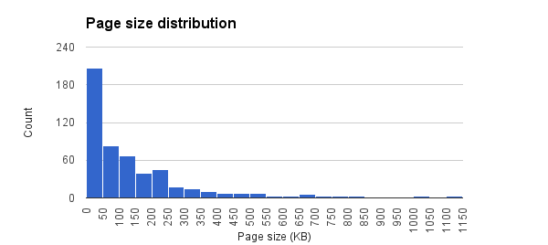
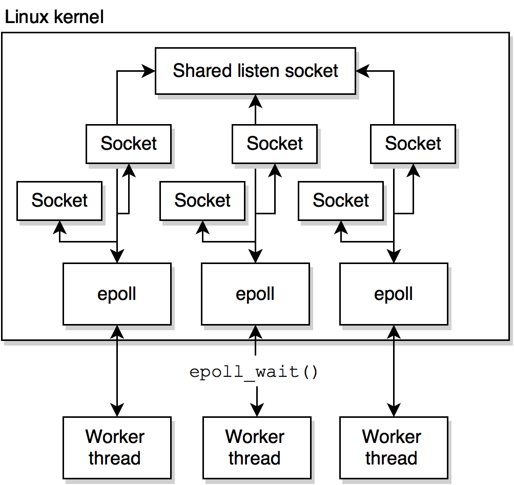
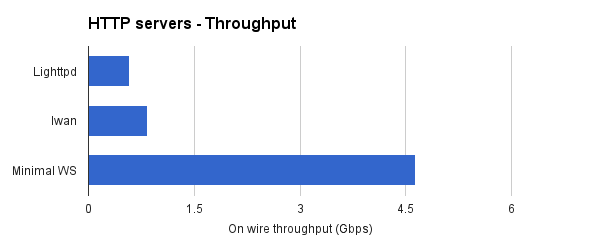
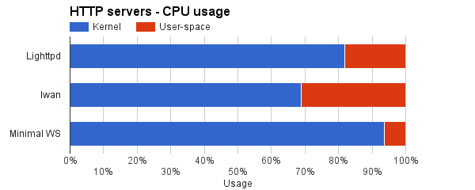
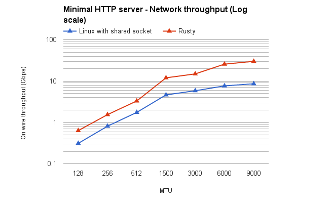
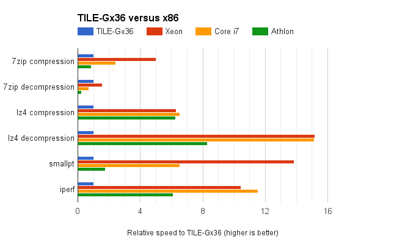

# Performance analysis

In this chapter, we will see how the performances of a minimal web-server
improve when it uses *Rusty* instead of the *Linux* network stack on the
*TILE-Gx36* device. You will see that *Rusty* scales far better than the *Linux*
network stack and that performances can be further improved by using *Jumbo
Ethernet Frames*, by improving dynamic memory allocations, or by using a faster
CPU architecture.

## Simulated traffic and test conditions

The *Rusty* framework has been developed to create an application able to
generate a large amount of *HTTP* sessions in order to qualify middleboxes for
highly loaded production networks. These middleboxes are developed to remove
specific content in web pages, such as advertisements.

In order to simulate this use case, the simulated traffic consists of random
requests for the front pages of the 500 most popular websites (according to
*Alexa* [Alex15]). The pages have been downloaded locally. Page sizes range from
3.5 KB ([wellsfargo.com](http://wellsfargo.com)) to 1.1 MB
([xcar.com.cn](http://xcar.com.cn)). The average page size is 126 KB, the 
median page size is 68 KB. 70% weight less that 150 KB, 90 % weight
less than 300 KB. Only 17 (3 %) weight more that 500 KB. The following graph
shows the distribution of page sizes in the 500 pages set:

*TCP* connections are not used for more than one *HTTP* request. A new *TCP*
handshake is initiated for every *HTTP* request. During the following tests,
web-servers have been flooded with 1000 concurrents *TCP* connections during 50
seconds, using *wrk*, a scriptable *HTTP* benchmarking tool [Gloz15]. Network
stacks have been configured with an initial *TCP* window size of 29,200 bytes
(*Linux* default). Turning the congestion control algorithm on the *Linux*
stack from *Cubic* (default) to *Reno* does not produce any change in the
observed performances: the link capacity is higher than the throughput of the
applications and retransmissions do not occur.

Please remember that *HTTP* requests are currently not generated on the
*TILE-Gx36*, but on a separate *x86* server. This server fully capable of
generating the amount of requests required for the tests to follow. The
*TILE-Gx36* only serves the pages via a web-server.

## Minimal web-server

To minimize the overhead brought by full featured web servers, I wrote a
minimal web-server that runs on top of *Rusty* or on top of *BSD* sockets as
provided by the *Linux* operating system. This server only reads the first line
of the *HTTP* requests, and ignores any other *HTTP* header. Because of this, it
is not fully compliant with the *HTTP* protocol, but still adequate to simulate
web traffic.

This minimal web-server also preloads in memory all the pages that can be
served. It was observed that this slightly increases performances, even 
compared to a `sendfile()` system-call.

> **Note** `sendfile()` is used to transfer data between two file descriptors.
> Because this copying is done within the kernel, it does not require
> transferring data from user-space. File descriptors also identify sockets
> in UNIX operating systems.

## Shared BSD sockets

When running on top of the *Linux* stack, the minimal web-server uses the
*epoll* system-calls to watch for events on the *TCP* connections it manages. 
It also uses the *shared sockets* feature which has been introduced in *Linux 
3.9* (April 2013). 

The web-server spwans a defined number of *worker threads*. Each worker thread
has its own *epoll*. An *epoll* is an event queue shared by the operating system
and the application. It allows the kernel to notify the application of events
on a set of file descriptors (events like a new connection or a new arrival of
data). Workers are constantly waiting for events on their queues, and processes
them as they arrive. All workers share a single server/listen socket (using the
new `SO_REUSEPORT` feature introduced in *Linux 3.9*). On new connections on
this shared socket, only one worker is notified, and receives the new client's
socket. The worker adds this socket to its event poll and processes any
event on it. The number of workers is usually lower or equal to the number of
cores on the hardware that runs the software. Without shared sockets, another
worker should be dedicated to listening for events on the server socket and to
load balance any new connection on the other workers.

This architecture is more efficient than the traditional "spawn a new thread
for each new incoming connection". It is the advised way of writing efficient
network applications on top of the *Linux* kernel [Kerr13].

The following graph shows, in terms of *HTTP* throughput, how this minimal
web-server (*Mininal WS* in the graphs) compares against full-featured servers
on the *TILE-Gx36*. *Lighttpd* (version 1.4.28) is a widely used *HTTP* server
which uses *epoll* (but not a shared socket) while *lwan* is a lightweight
server that uses *epoll* and shared sockets [Pere15].

> **Note**
> *nginx* (which is build around a shared socket and *epoll*) was also intended
> to be featured in this comparison, but I did not succeed at compiling it on
> the *Tilera* architecture. On the *x86* server, *lwan* is significantly
> faster than *nginx*.

The following graph shows how much CPU resources are spent in the kernel and in
user-space during the processing of an *HTTP* request:

The minimal web-server only spends 6% of its time in user-space. The only
system-calls it does are related to the sockets it handles, as files are
preloaded in memory during the initialisation. I think it is fair to say that
its performances are very close to the best that one can expect to get from an
network application running on top of the *Linux* stack.

## Comparing Rusty and the Linux stack

The following graph shows how the minimal web-server performances increase with
the number of enabled cores on the *TILE-Gx36*:

*Rusty* performances scale linearly with the number of cores. It fulfills a
single 10 Gbps *Ethernet* link with 29 cores, because of that, starting with
29 cores, the load was evenly balanced over two links. The throughput of a
single worker tops at 395 Mbps, while it reaches 12 Gbps with 35 workers.

> **Note** The *Rusty* throughput on one core is zero because the framework
> requires at least two cores to operate: one that executes the network stack,
> and another for the operating system.

The *Linux* stack, unlike *Rusty*, fails to scale correctly on more than seven
cores. The problem is a well-known fact and is caused by a thread contention
when allocating and dereferencing file descriptors [Boy⁺08].

## Changing the MTU

In the previous paragraphs of this analysis, the *Maximum Transmission Unit*
(MTU) was set to 1500 bytes, which is the MTU of conventional *Ethernet* frames
and the default value used by *Linux* (and probably the most frequently
experienced on the Internet [citation needed], which would justify its usage
within a web traffic generator).

The following graph and table show how the two network stacks react when the
MTU is increased or decreased. Both stacks support *Ethernet Jumbo Frames* and
all the cores of the *TILE-Gx36* were used.

| Thoughput (Gbps) \ MTU (bytes) | 128 | 256 | 512 | 1500 | 3000 | 6000 | 9000 |
|-------------------------|-----|-----|-----|------|------|------|------|
| Linux with shared socket|0.3 |0.8 |1.8 |4.6  |5.8  |7.7  |8.6  |
| Rusty                   |0.6 |1.5 |3.3 |12 |14.9 |25.7 |30 |

Using larger MTUs increases performances. This is mostly because, by sending
larger segments, we receive less acknowledgement segments: the cost of writing
more segments is not as much an overhead as receiving and processing more
acknowledgements. However, using jumbo frames to simulate *HTTP* sessions would 
not be representative of the typical *HTTP* traffic on the *Internet*.

## Profiling the framework

The main performance issue while running the minimal *HTTP* server over *Rusty*
is linked to dynamic allocations, accounting for about 65% of the consumed CPU
cycles. Copying the payload into the segment only consumes about 5% of the
execution time (because of an efficient use of prefetching). About one percent
of the execution time is used to interact with the network driver. Thanks to
the precomputed checksums, less than one percent of the execution time is spend
in computing checksums. The bulk of the remaining execution time is consumed by
various procedures of the network stack and of the application layer.

As it is, the framework relies on dynamic allocations to:

* Manage the timers used by the *ARP* and the *TCP* layers. Timers are kept
  sorted in a binary search tree. The *TCP* layer reschedules the retransmission
  timer virtually every time an acknowledgement segment is received, which leads
  to one or more dynamic allocations because of the inability of the standard
  *C++* binary tree container to move an entry in the tree.
* Simplify the memory management of network buffers. When a network buffer is
  allocated by the application, a *C++* `shared_ptr` is instancied in order
  to automatically release the buffer once it is no longer in use. The
  `shared_ptr` requires the allocation of a structure to maintain its reference
  counting mechanism. The use of `shared_ptr`s is really penalizing because of
  this memory allocation, the reference counting machinery does not induce any
  serious performance overhead.
* Manage the transmission queue of the *TCP* layer.
* Handle closures. The compiler can generate code to allocate memory on the
  heap to store the variables that closures capture (especially in writers).
* Allocate the structures that store the state of a TCP connection (the
  *TCP Control Block*).
* Store out of order segments.

Dynamic allocations are particularly slow on the *TILE-Gx* architecture. A
single allocation takes about 800 ns (1000 cycles) on the *TILE-Gx* while it
takes about 100 ns (200 to 300 cycles, depending on the frequency) on a modern
*x86* microprocessor.

Except for the closures, all allocations are done through a single standard
*C++* allocator instance. It could easily be substituted with another more
efficient allocator, that relies on memory polls (*mTCP* and *Seastat* rely on
a such allocator). This would probably substantially lessen the cost of memory
allocations and increase throughput. It has not been done yet because of a
lack of time. The substitute allocator would have to be able to benefit from
the *homed* memory pages provided by the *Tilera* hardware, like the current
one does.

Existing allocations could also be removed (especially by rewriting closures
so they do not allocate memory).

## Performances of the TILE-Gx36

In the course of the development of this software, I noticed that the
*TILE-Gx36* was seriously slower than present-day *x86* microprocessors, even
with all its 36 cores used efficiently.

To highlight the relative low performances of the *TILE-Gx36*, I executed a few
CPU-intensive tasks and compared their execution speed to those of three others
*x86* computers:

* A server with two 8-core *Intel Xeon E5-2650*, running at 2.6 Ghz each ;
* An high-end desktop with a 6-core *Intel Core i7 4930K*, running at 3.4 Ghz ;
* A low-end desktop computer managed by a 4-core *AMD Athlon X4 750k*, running
  at 3.4 Ghz.

Four applications were evaluated:

* *7zip*, an widely used multi-threaded compression/decompression tool.
* *lz4*, a compression/decompression tool written for real-time application.
  The tool only uses one single core.
* *smallpt*, a small ray-tracer that runs on several cores.
* *iperf*, a system tool to benchmark the performances of the *Linux* network
  stack. The tool ran on the virtual loopback interface in such a way that the
  network hardware does not interfere with the results.

The following graph shows the results of this evaluation. Performances are
relative the *TILE-Gx36* (i.e. a value of 5 means that the corresponding chip 
is 5 times faster than the *TILE-Gx36*):

Except for the *7-zip* benchmark, the *TILE-Gx36* consistently lags behind
other chips, especially on the non-parallelized *lz4* benchmark. On the
parallel *smallpt* test, the *Tilera* chip is almost two times slower than one
of the cheapest *x86* CPU currently sold.

Hence my view that an significantly higher throughput could potentially be
obtained by porting *Rusty* on a many-core *x86* system with a NIC supporting
the load balancing of TCP flows, on which the *Linux* stack would probably
fail to scale correctly. The *TILE-Gx* architecture could still be an
interesting platform for network applications that can benefit from the 
hardware packet classifier though.
